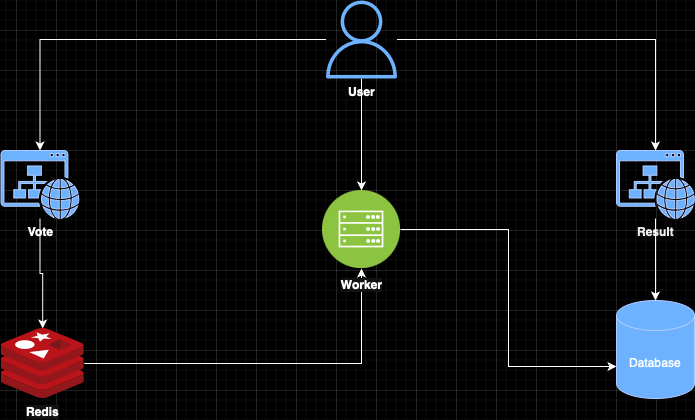

# Overview
The **Advanced Voting Application** is a distributed system. It consists of multiple microservices, each responsible for a specific part of the system.

## Architecture
The system is composed of the following components:
1. **Worker Service**: A .NET-based background service for processing votes.
2. **Result Service**: A Node.js-based service for displaying voting results.
3. **Vote Service**: A flask-based app for voting.
4. **Database**: PostgreSQL is used for storing votes.
5. **Redis**: Enables caching.

## Labs
* [Prerequisites](docs/01-prerequisites.md)
* [Containerized-Vote](docs/02-containerized-vote.md)

## advanced-voting-application

## Note
The code has been taken from the famous the popular [example-voting-app](https://github.com/dockersamples/example-voting-app/tree/main)